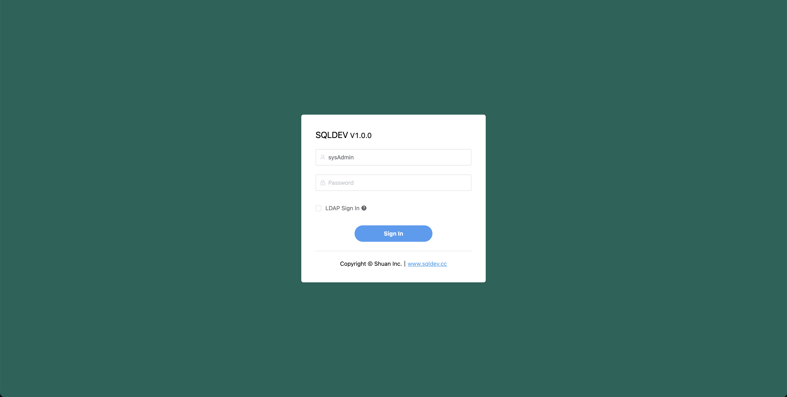
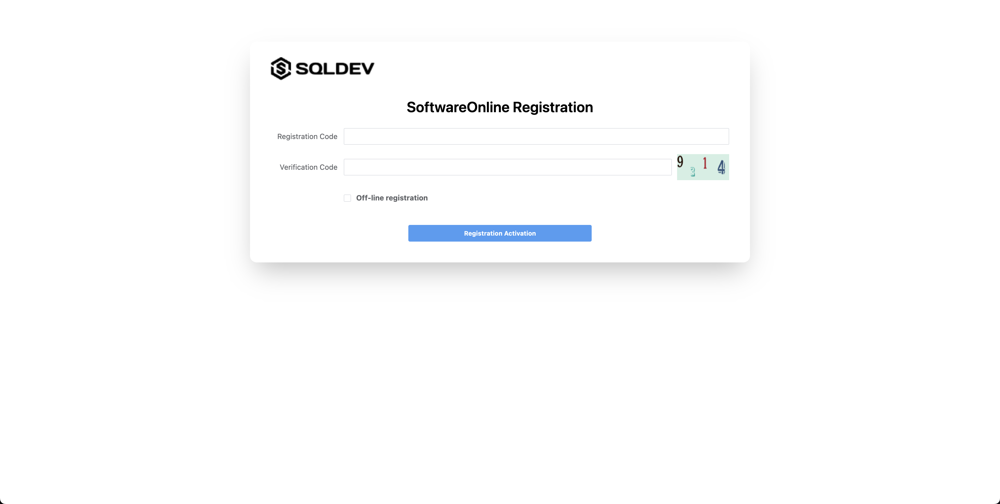

# Install

#### one-click installation script

```
/bin/bash -c "$(curl -fsSL https://raw.githubusercontent.com/shuaninfo/sqldev-community-install/master/install.sh)"
```

Alternatively, you can refer to the following for a manual installation

##### default installation directory

```
cd /opt
```

##### Download the installation package

```
wget https://github.com/shuaninfo/sqldev/releases/download/sqldev-xxx.xxx.xxx.tar.gz
```

##### unzip

```
tar -zxvf sqldev-xxx.xxx.xxx.tar.gz
```

##### Go to the application directory

```
cd sqldev
```

##### install dependencies mysql redis oracle-lib

```
sh install.sh
```


##### start

```
# start
sh start.sh

```


##### Visit http://应用ip地址:9000 with a browser (Chrome recommended)





1. The first installation will enter the initialization interface, if the initialization interface does not appear here, please refresh your browser.

2. After the initialization, please pay attention to save the account password information.

3. Click the jump to login and use the administrator account to log in to the system.


##### Registration Activation

> If you have not applied for license registration code, please apply for [license](. /license.md)





##### After activation, click on the menu to enter the software usage interface


##### FAQ

**. /sqldev: error while loading shared libraries: libclntsh.so.12.1: cannot open shared object file: No such file or directory**

Solution: `source /etc/profile `

Restart the application
