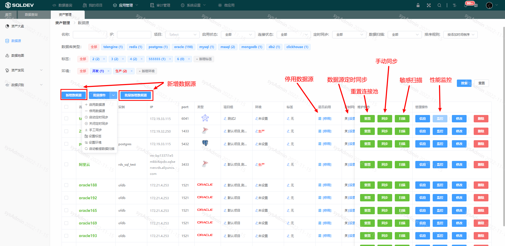
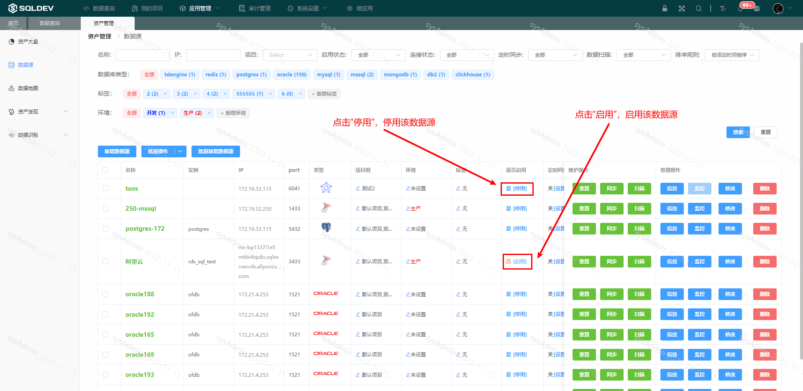
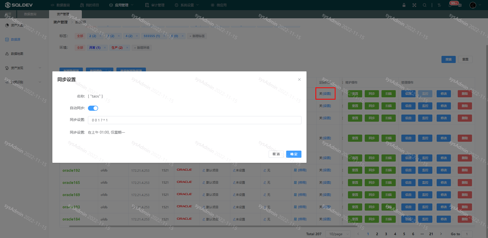
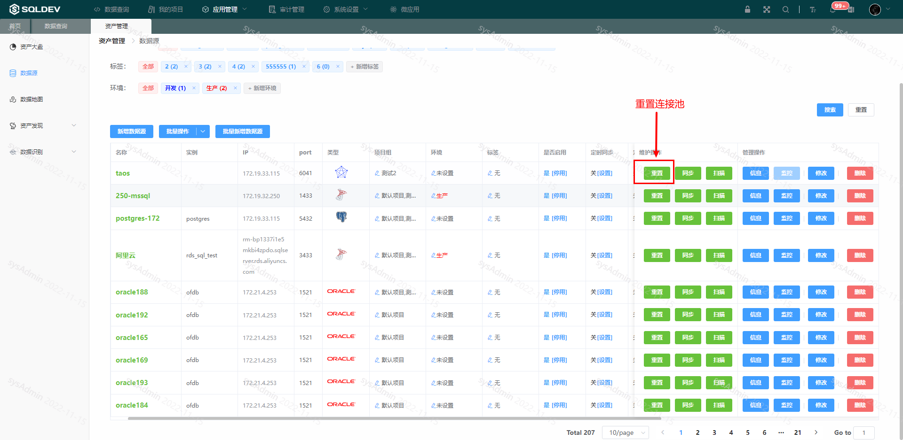
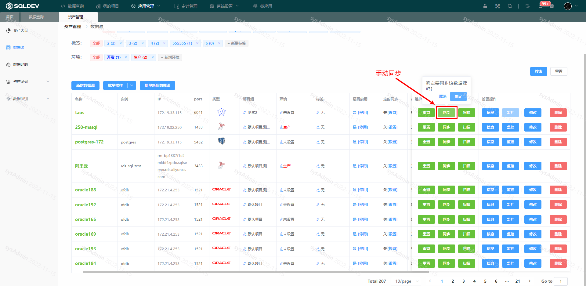

# Data Source

#### 1. Add data source

###### Data source management

> System administrator to manage data sources.
>
> 1. Add a new data source
>
> 2、Open data source/deactivate data source
>
> 3、Timing synchronization of data source
>
> 4. reset the data source connection pool
>
> 5、Manually synchronize data source
>
> 6、Modify data source configuration
>
> Operation.
> 1.
> 1. Click "Application Management" - "Asset Management" - "Data Source" menu
>
> 2、Operation

Figure: Data source list figure

###### Add a new datasource

> Operation.
>
> 1. Click the "Add Data Source" button
> 1. Click the "Add Data Source" button.
> 2. In the pop-up box, enter the data source name, select the data source type, and enter the data source description.
>
> 3. Click OK

Figure: New datasource figure

###### Enable/disable datasource

> Operation.
>
> 1. Click "Disable"/"Enable", as follows.

Figure: Disable/enable datasource figure

###### Timed synchronization of data sources

>For data sources where the data structure changes frequently (adding tables, modifying table structures, etc.), you can use the timed synchronization feature.
>
> Operation.
> 1.
> 1. In the "Timed Synchronization" column, click "Settings".
>
> 2. Turn on the "Auto Sync" switch
> >
> 3. Set the synchronization rules
>
> 4、Click OK

Figure: Timed synchronization diagram

###### Resetting the connection pool for the datasource

> Reset the connection pool for the datasource
>
> Operation.
>
> 1. Click the "Reset Connection Pool" button, as follows

Figure: Reset connection pool figure

###### Manually synchronize datasource

> Manually synchronize the datasource

Figure: Manual Sync Figure

###### Modify data source configuration

> name, ip address, port, database, username, password, permissions, number of connections, maximum number of queries, description
>
> Operation.
> > Click
> 1. Click "Modify" button
>
> 2. Modify the data source information, as follows.

Figure: Data source configuration diagram

