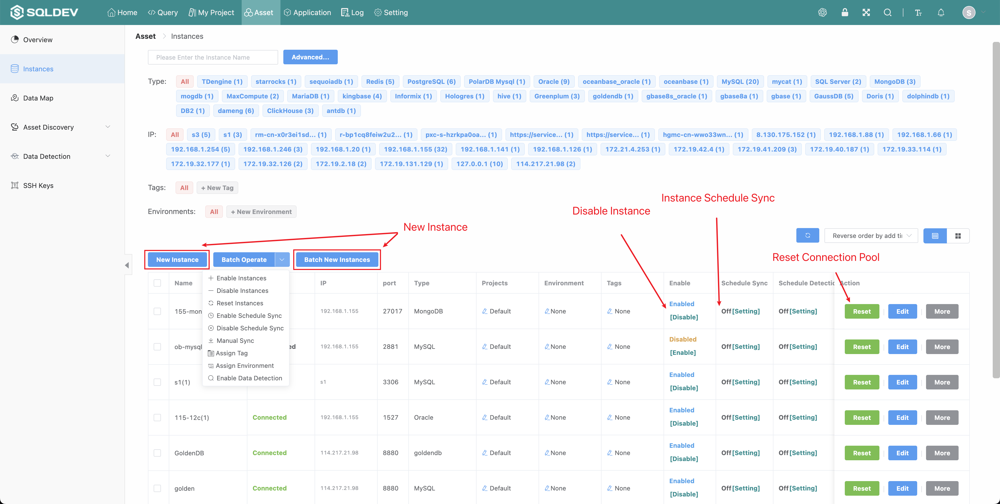
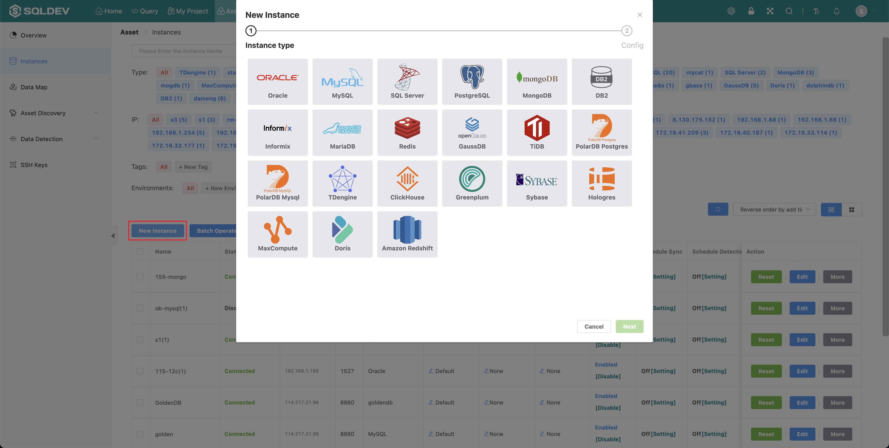
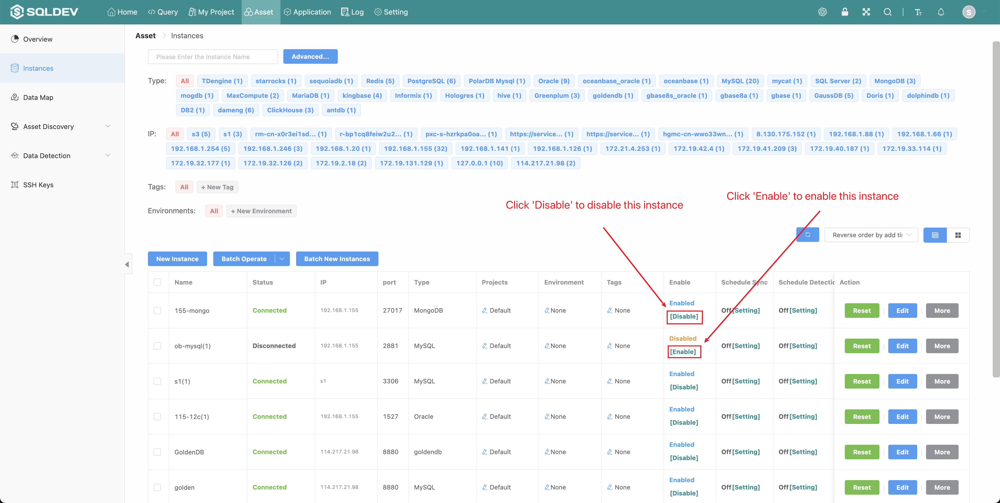
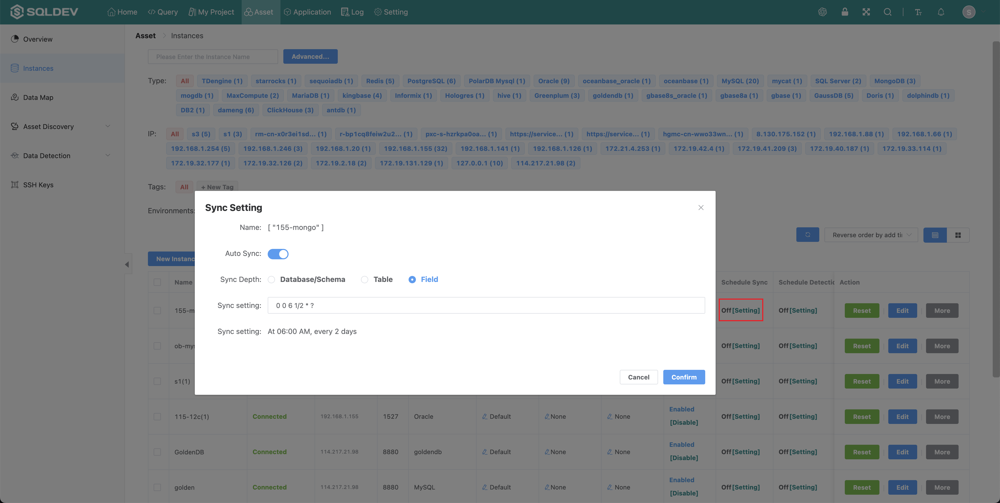
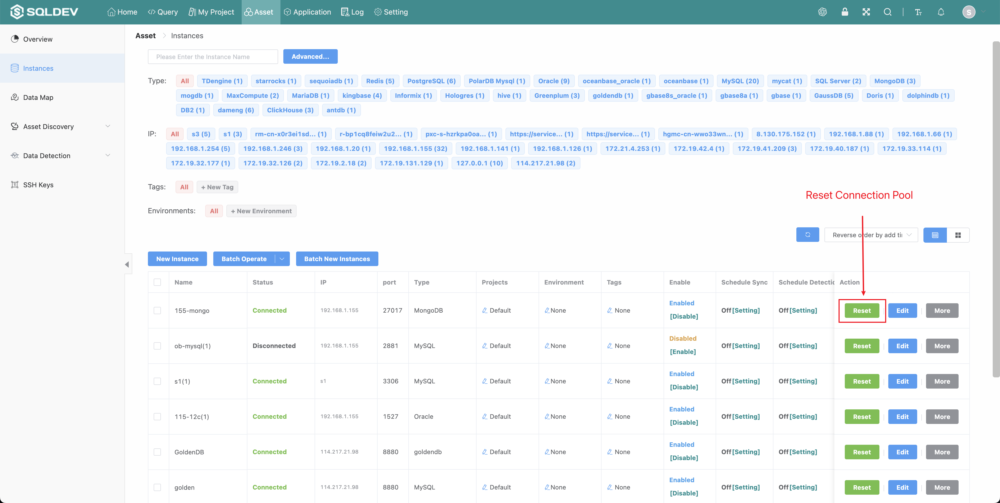
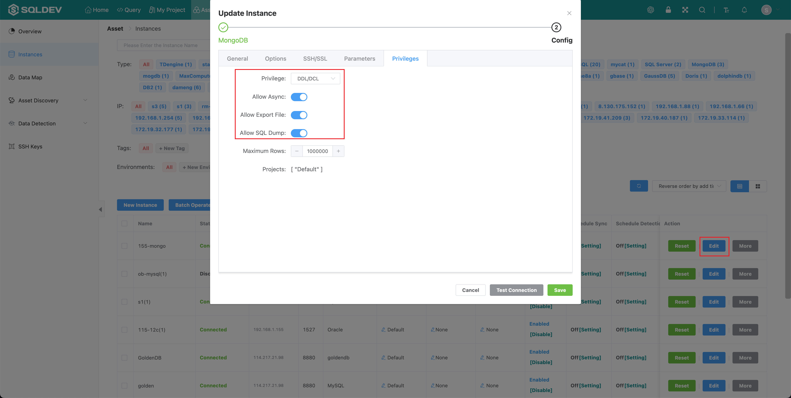

# Instance

#### 1. New Instance

###### Instance management

> System administrator to manage instance.
>
> 1. Add a new instance
>
> 2. Enable/Disable a instance
>
> 3. Schedule sync of a instance
>
> 4. Reset the instance connection pool
>
> 5. Edit instance configuration
>
> Operation.
> 1.
> 1. Click "Asset" - "Instances" menu
>
> 2、Operation

Figure: Instance list figure

###### Add a new instance

> Operation.
>
> 1. Click the "New Instance" button
> 2. In the pop-up box, enter the instance name, select the instance type, and enter the instance description.
> 3. Click OK

Figure: New Instance figure

###### Enable/Disable a instance

> Operation.
>
> 1. Click "Disable"/"Enable", as follows.

Figure: Disable/enable instance figure

###### Schedule sync of a instance

>For instances where the data structure changes frequently (adding tables, modifying table structures, etc.), you can use the timed synchronization feature.
>
> Operation.
> 1. In the "Schedule Sync" column, click "Settings".
>
> 2. Turn on the "Auto Sync" switch
>
> 3. Set the synchronization rules
>
> 4. Click OK

Figure: Timed synchronization diagram

###### Reset the instance connection pool

> Reset the connection pool for the instance
>
> Operation.
>
> 1. Click the "Reset Connection Pool" button, as follows

Figure: Reset connection pool figure

###### Edit instance configuration

> name, ip address, port, database, username, password, permissions, number of connections, maximum number of queries, description
>
> Operation.
> 1. Click "Modify" button
>
> 2. Modify the instance information, as follows.

Figure: Instance configuration diagram

