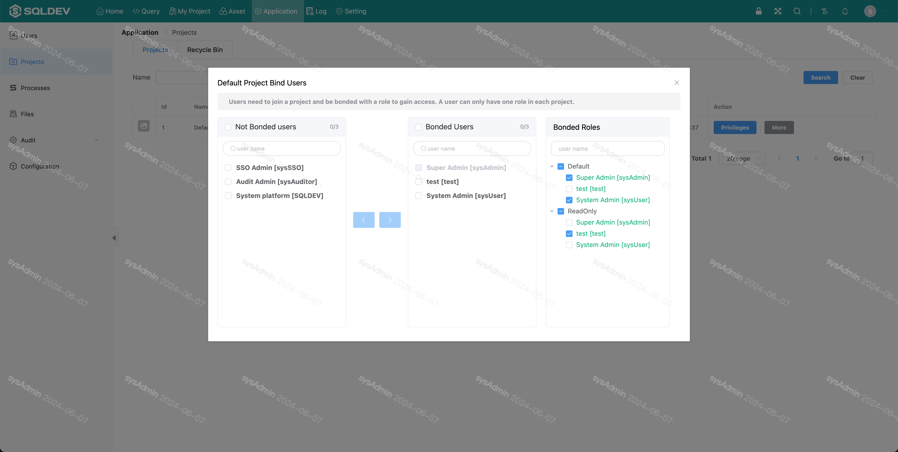
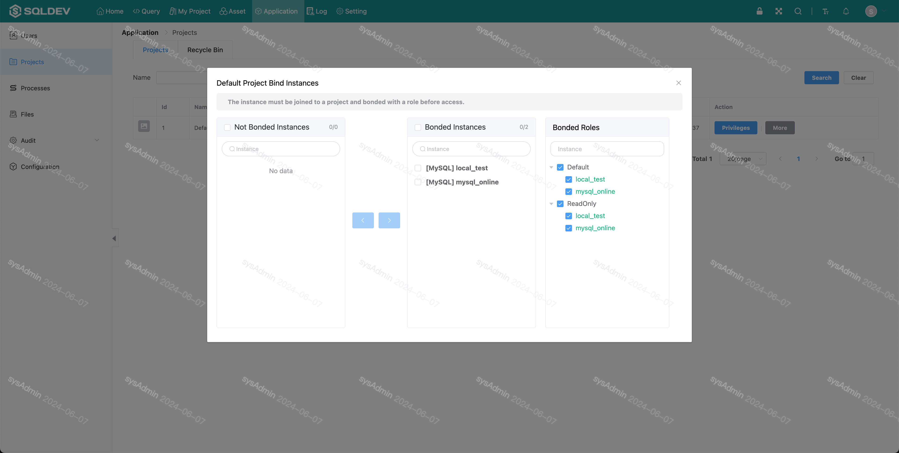
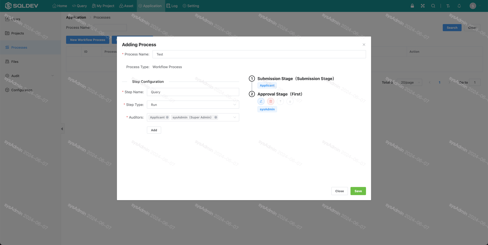
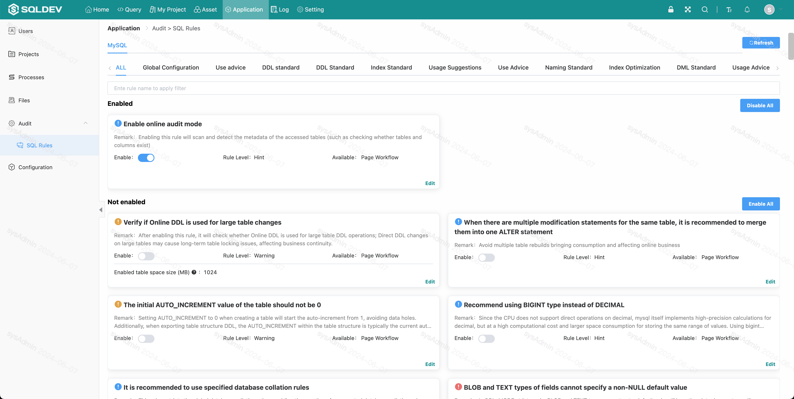
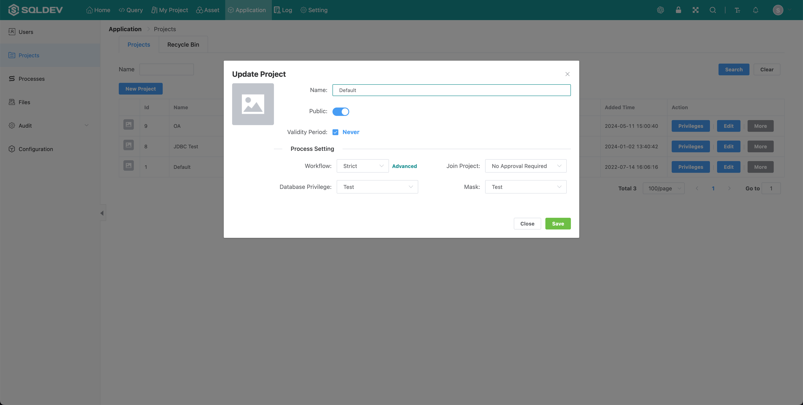

# Projects

##### New Project

> Operation.
>
> 1. Click the "New Project" button
>
> 2. In the pop-up box: enter the project name, select whether to make it public** (users can actively apply to join the public project)**, check the permanent validity or set the expiration time

* Public project: users can apply to join on their own initiative
* Project set expiration date: the project will be inoperable after expiration

Image: New project image

##### Associate/Remove Project Members & Set Project Administrator

> Project associate user, project move out user
>
> Operation.
> > Click
> 1. Click the "Members" icon to associate/move out users
>
> 2. Click the "Add"/"Remove" button to manage project users, as follows.
>
> or
> > or
> 2. Click "[+]" in the "Manage Permissions" column to set the project administrator, as follows.

Figure: Associate/Move out users & set project administrator figure

##### Project Instance Management

> Operation.
>
> 1. Click the "Instance" icon to associate/move out instances
> 2.
> 2. In the pop-up box, click the "Move Out" button to move out the project
>
> or
>
> 2. In the pop-up: click "Add" button to associate the item with the instance

Figure: Project instance management diagram

##### Workflow

> Default is the current group (one of the administrators of the current project) review, select multiple permission groups approval process for multi-level review, users with administrative rights in the permission group can review.
>
> Operation.
> Operation
> 1. Click "Process" button
>
> 2. In the pop-up wide: multi-select process, as follows.

Figure: Workflow process setup diagram

##### Auditing (configuration)

> Audit rules can be modified only if project-specific auditing is enabled
>
> Operation
> > Action
> 1. Click the "Audit" button
>
> 2. pop-up box: open the project-specific audit, edit the project audit configuration (after opening, the configuration only works for the project)

Figure: Audit configuration diagram

##### Edit project

> Function: Edit the project name, edit whether the project is public or not, edit the project expiration date
>
> Operation.
>
> 1. Click the "Edit" button.
>
> 2. pop-up box: enter the project name, open/close whether the project is public, check whether the project expiration time is permanent or set the project expiration time, as follows.

Figure: Edit project information figure

