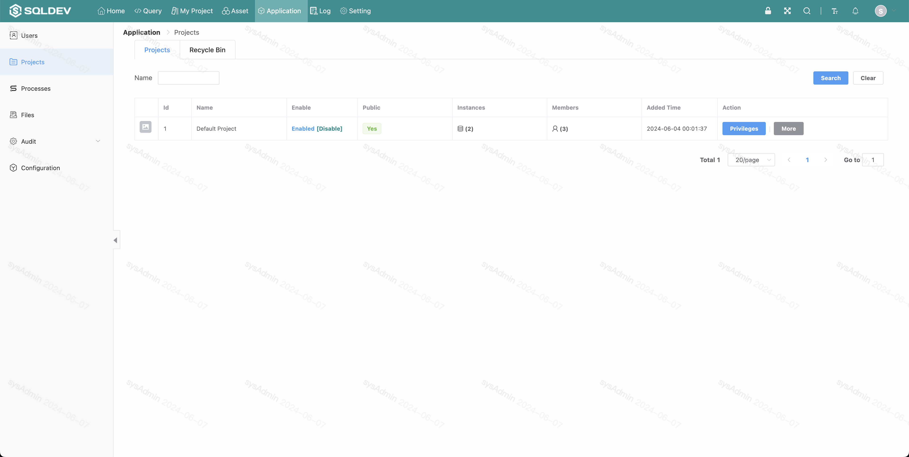
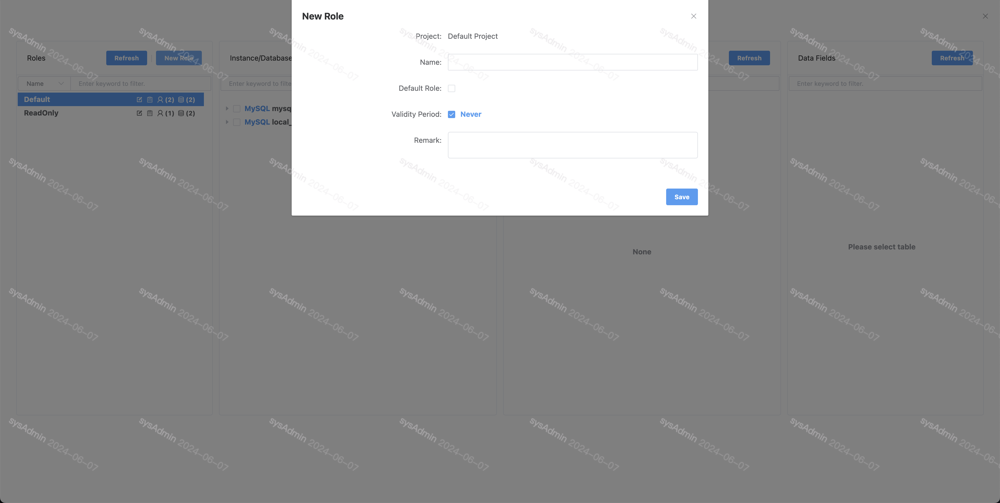
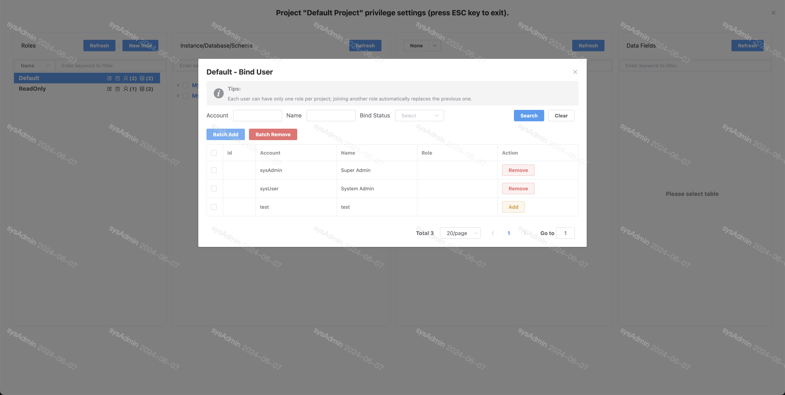
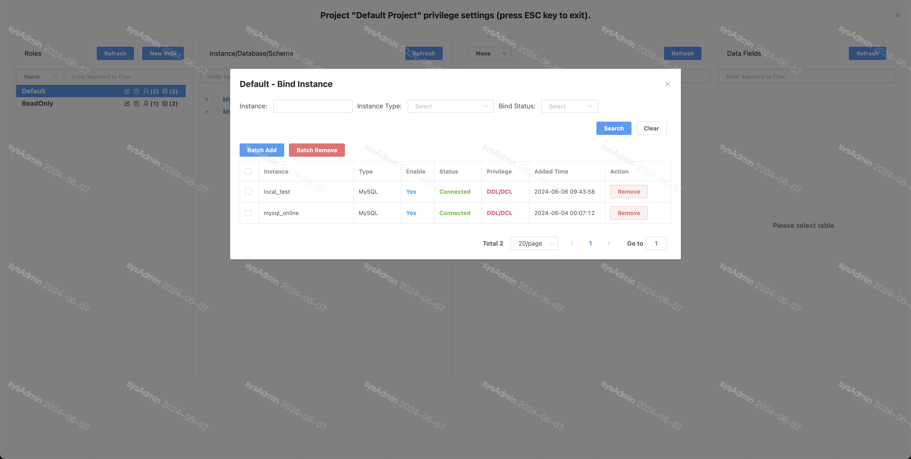
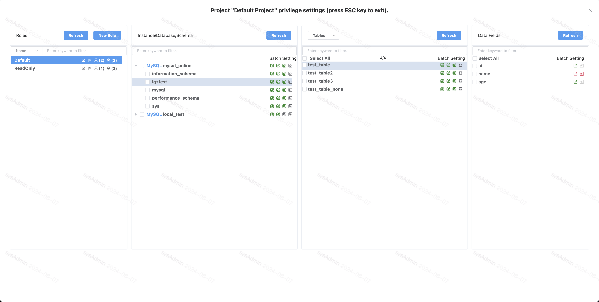
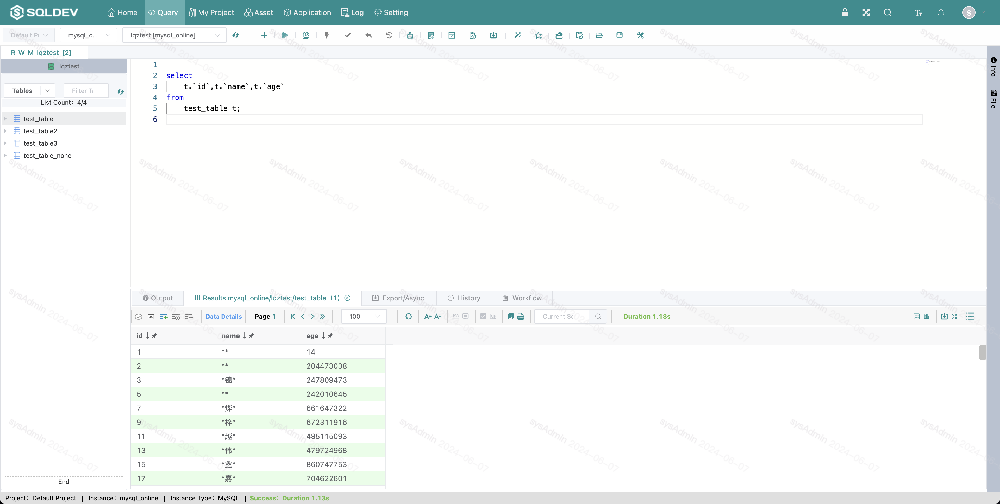

# Roles

The role here, which is the role in the project, requires administrator status, go to project management and select menu [Permissions-->Permissions Settings].

##### 1. Go to role setting

##### 2. Create roles

Create a role in the project role settings

Image: Create role image

##### 3. Role association/removal of users

Click the user icon of the role to associate the user to the role in the popup window

Figure: Role association/removal of users figure

##### 4. Role association/removal of data source

Click the role's database icon to associate the database to the current role in a popup window.

Figure: Role association/removal data source diagram

##### 5. Role permission settings
Click the role name to expand the list of data sources associated with the current role, and click the corresponding data source to set read-only (DQL), read-write (DML), and administrative (DDL) permissions for libraries and tables.

Figure: Role permissions diagram

##### 5. Field desensitization settings

Click the role to expand the data source associated with the current role, select "Sensitive" on the corresponding field, select the desensitization method in the popup window and click the button to submit.

Select the desensitization method in the pop-up window and click the button to submit. [image-20210817134512969](./img/role6.png)

Figure: Field desensitization diagram

After setting up, cut back to the query page and check the query results, the fields have been desensitized and displayed.

Figure: Query desensitization map

