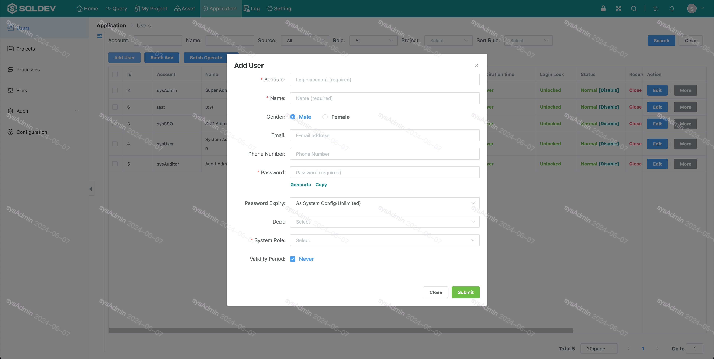
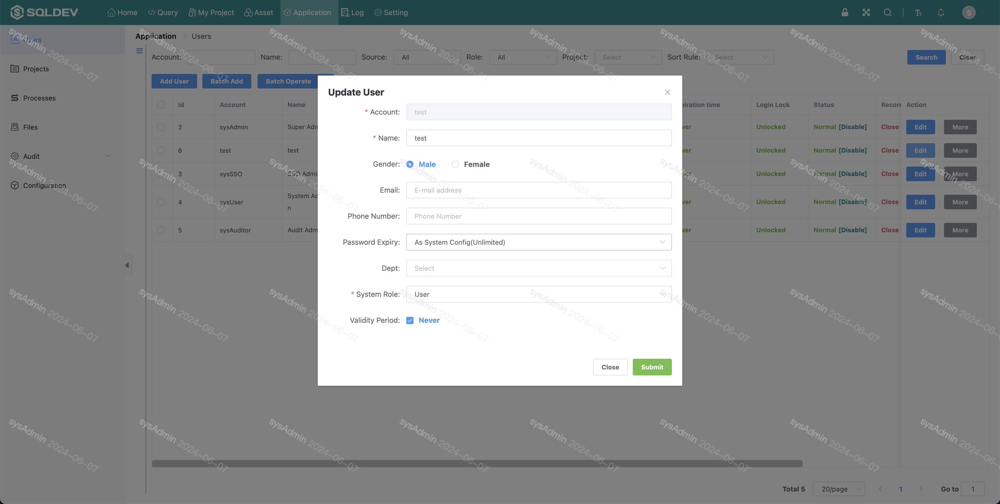
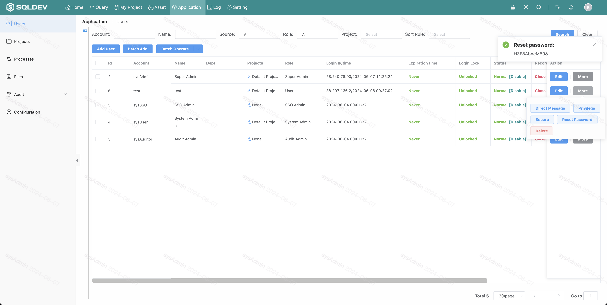

# Users

##### New User

> The new user is the system user, this user can login to SQLDEV system, this user can apply to join the project, or the administrator associated to enter the project
>
> Operation.
>
> 1. Click "Add User" button
>
> 2. pop-up box: fill in the login name, name, password, system role, as follows.

Figure: Add user figure

##### Modify user

> Operation.
> Modify
> 1. Click the "Modify" button.
> 1. Click the "Modify" button.
> 2. pop-up box: modify, name, system role, as follows.

##### Reset password

> Change password / Reset password
>
> Operation.
>
> 1. Click the "Reset Password" button
>
> 2. pop-up box for the reset password

Figure: Reset password figure

