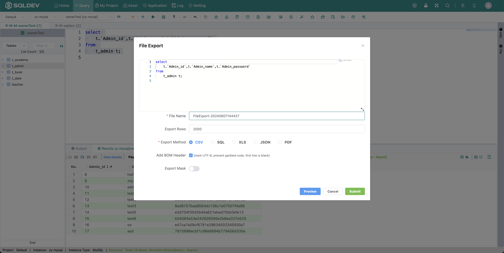
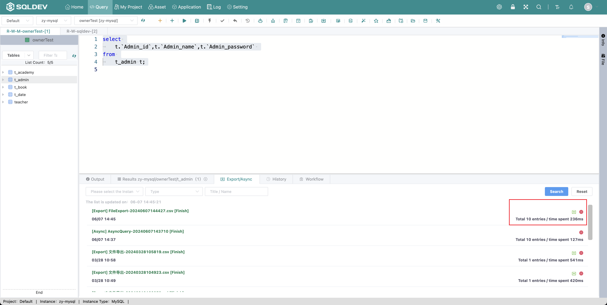

# Asynchronous Export

> Note: Export SQL execution results, support CSV, SQL, XLS, JSON four kinds of export methods
>
> Operation.
>
> 1. Select SQL
>
> 2. Click  "Asynchronous Export" button
>
> 3. Enter the name, number of queries, and export type in the pop-up box
>
> 4. Click Submit
>
> 5、The result of asynchronous export can be viewed in the "Export and Asynchronous" list.
>
> 6、Click on the right side of the list "Download" button to download the export results

Figure: Create asynchronous export graph

Figure: Asynchronous export list graph
