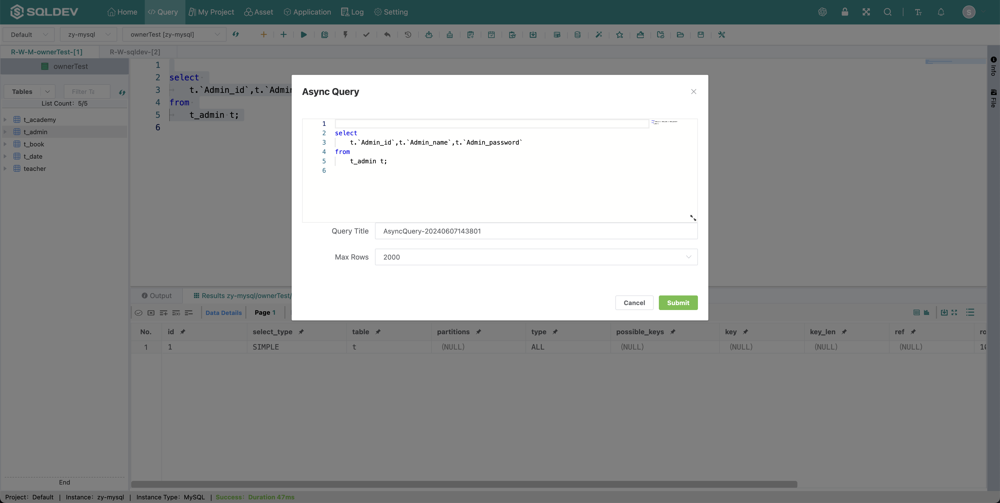
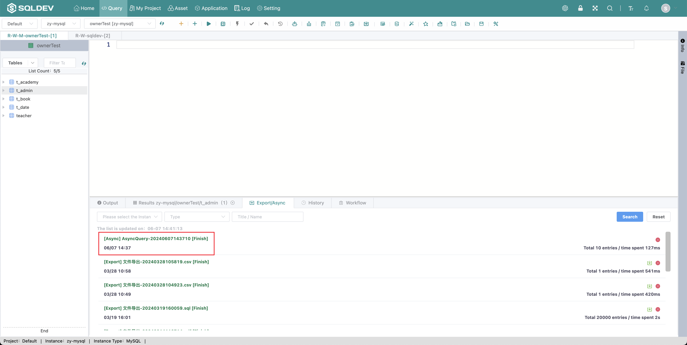
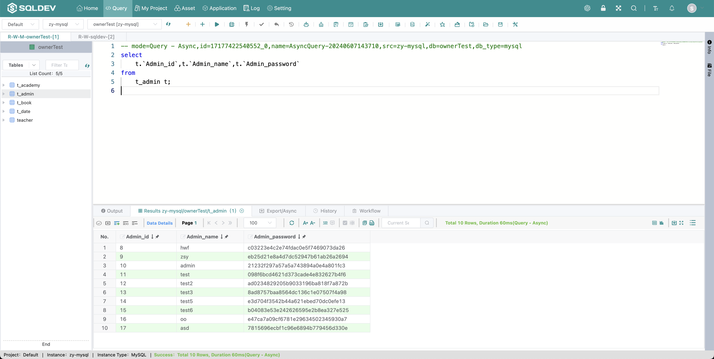

# Asynchronous Query

> Note: You can use this function when the SQL execution time is too long, the query result will be cached to the server, and you can view it in the "Data Display Area" - "Export and Asynchronous" table after the asynchronous execution is finished.
>
> Operation.
>
> 1. Select SQL
>
> 2. Click  "Asynchronous query" button
>
> 3. Enter the name and number of queries in the pop-up box
>
> 4. Click Submit
>
> 5、The asynchronous query result will be viewed in the "Export and Asynchronous" list

Figure: Creating an asynchronous query graph

Figure: Asynchronous query list graph

Figure: Asynchronous query result graph
