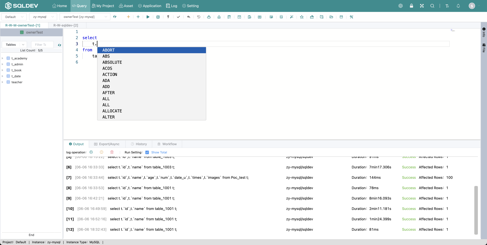

# Auto Prompt

> Enter query statement, prompt for: keywords, data table, fields
>
> Operation.
>
> 1. Enter the SQL statement normally
>
> 2、When prompt appears, press "↓" or "↑" key to switch the prompt to be selected
>
> 3、Press "Enter" to enter the keyboard, select the prompt to be selected

Figure: Auto Hint Figure

