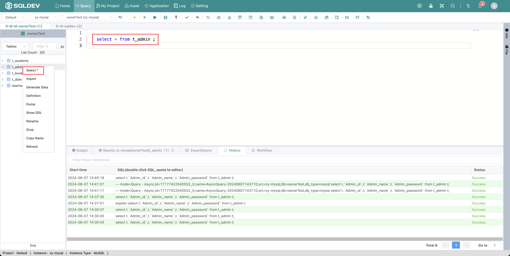

# Automatic SQL Generation

> Quickly generate common SQL statements
>
> Operation.
>
> 1. Click the table name to generate a query statement
>
> or
>
> 1. Right-click
>
> 2. Click the right-click menu to generate the corresponding SQL

Figure: right-click to generate the script image
