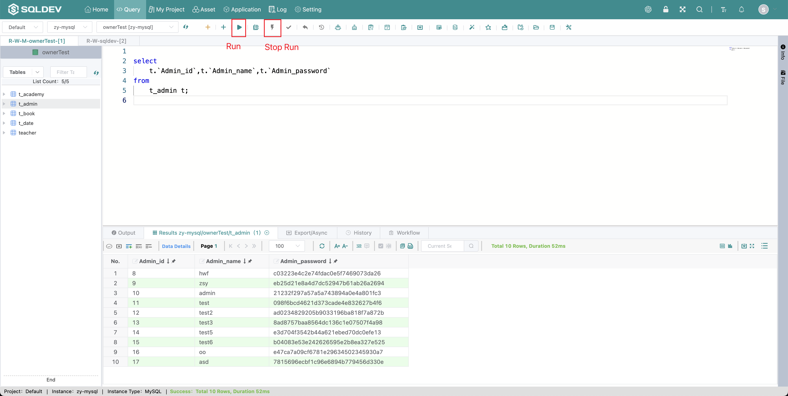

# Execute/Interrupt Script

> **Execute script**.
>
> Operation.
>
> 1. Check the SQL statement (uncheck the SQL then execute all SQL in the editor)
>
> 2. Click  "Execute" button to execute the SQL statement
>
>
>
> **Interrupt execution**: When the execution of the script is too long, click the interrupt execution (when red is clickable) to end the execution of the script.
>
> Operation.
>
> 1. When clicking  "Execute" button, and the execution of SQL is not completed, i.e., the execution time is too long in the interruptible state: 
>
> 2. Click "break" button to break the current execution

Figure: Execution script figure

####
