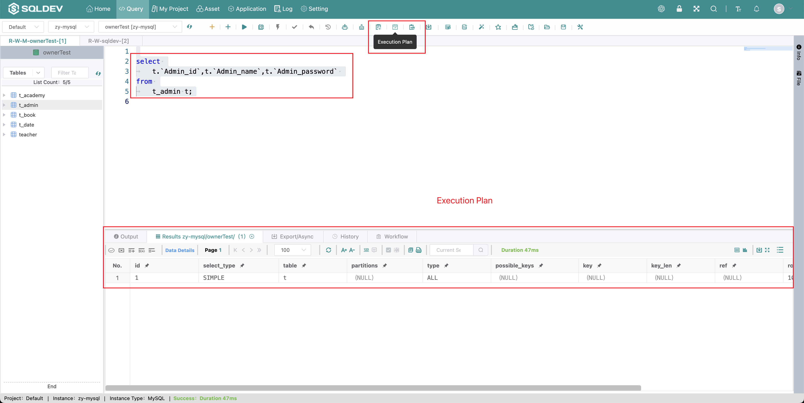

# Execution Plan

> Select the SQL statement to be executed and click Execution Plan
>
> Operation.
>
> 1. Select the SQL statement
>
> 2. Click  "Execute Plan" button

Figure: Execution plan diagram

