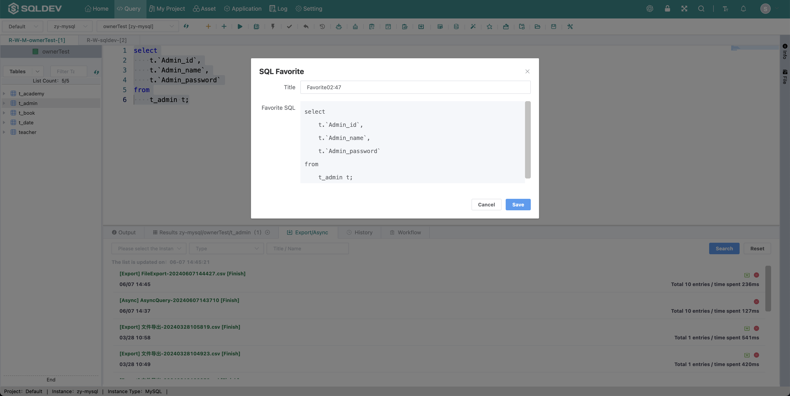

# Favorite Code

> Only in the current database collection code, such as: when the database is "safe" collection code "query student results", the "query student results" only in the database is when the database is "safe".
>
> Operation.
> 1.
> 1. Select the SQL code
>
> 2. Click  "Favorite Code" button
>
> 3. Enter the name in the pop-up box
>
> 4. Click OK

Figure: Collection code figure

