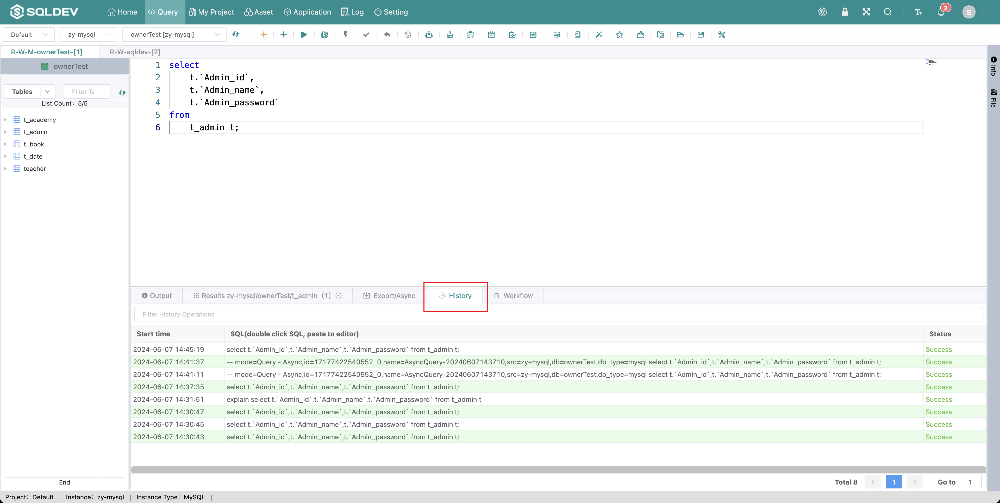

# History

> List of SQL records executed by the user in the current database, click the "History" tab to refresh the list
>
> Operation.
>
> 1. Click "Data Display Area" - "History Operations"

Figure: SQL history graph

####