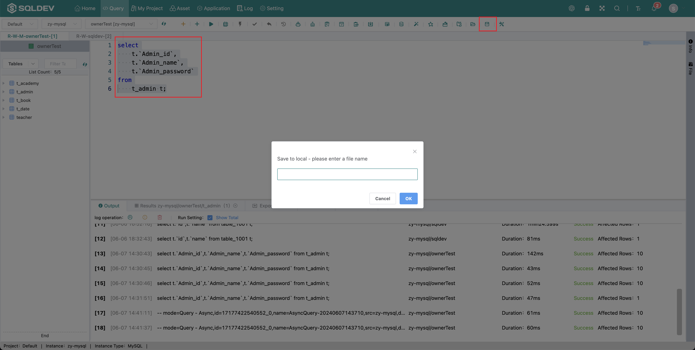
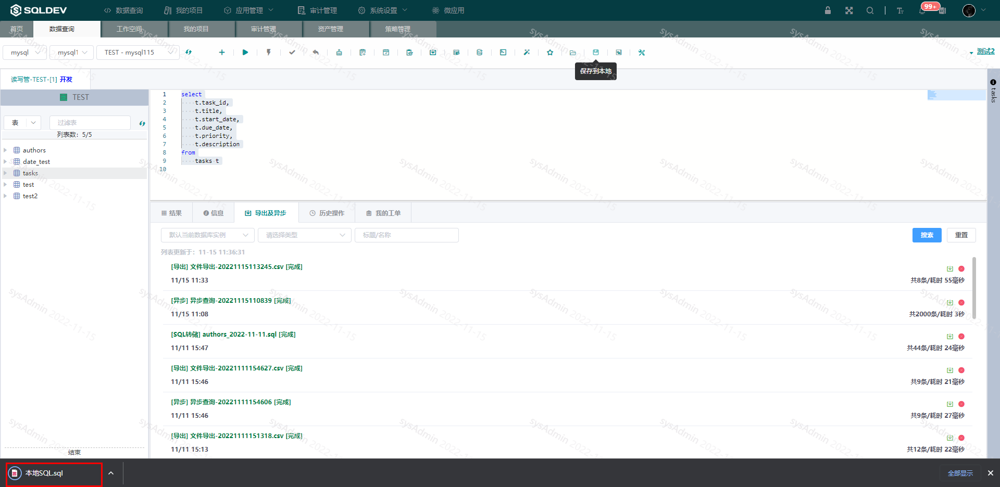

# Save To Local

> Save selected SQL code or all code in the SQL editor
>
> Operation.
>
> 1. Select SQL
>
> 2. Click  "Save to local" button
> 3.
> 3. Enter the name in the pop-up box
>
> 4. Click OK

Figure: Save SQL Figure

####