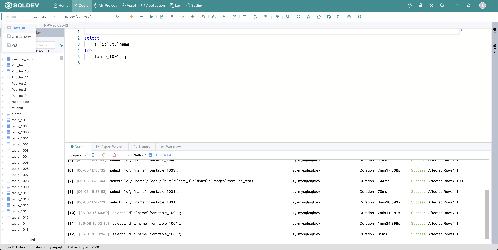
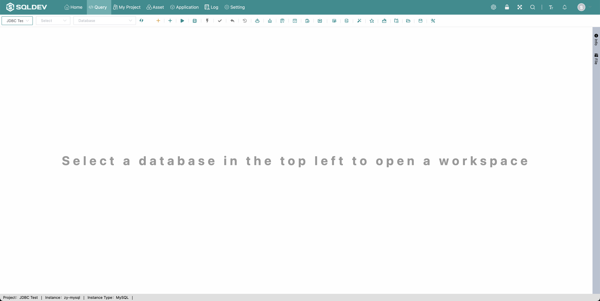

# Switching Projects

> tab page will be saved under the current project, as shown in the figure: "Test 2" project has a "Read/Write/Manage-TEST-[1] Development" tab page, "Test 3" has no tab page
>
> Operation.
>
> 1. Click the project list
>
> 2. Click on the item to be selected to switch items

Figure: Test 2 project diagram

Figure: Test 3 project image

