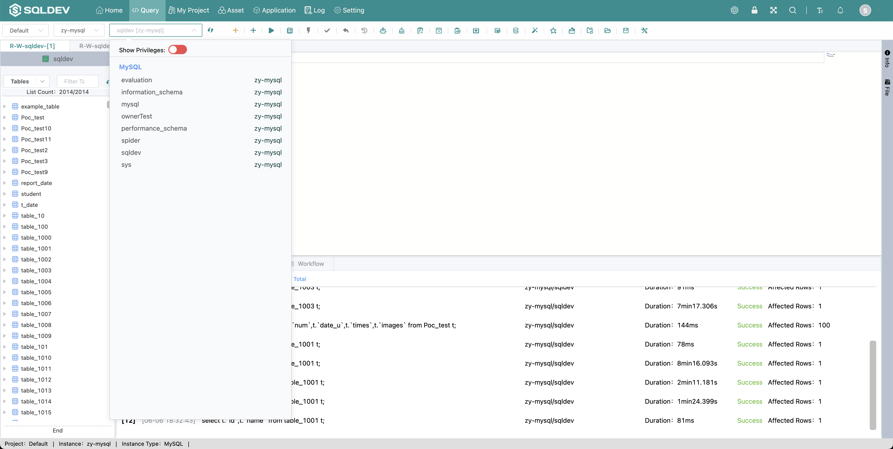
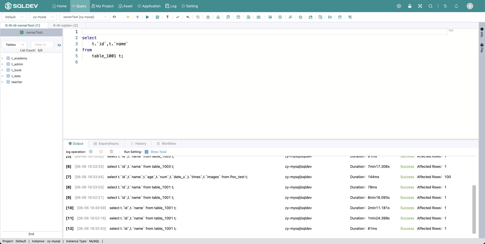

# Use Database

> Operation.
>
> 1. Click on the database drop-down list
>
> 2. Click on the database to be selected and select the database (if there is no tab page currently, a tab page will be created automatically)

Chart: Select database chart

Chart: Add Tab Chart

