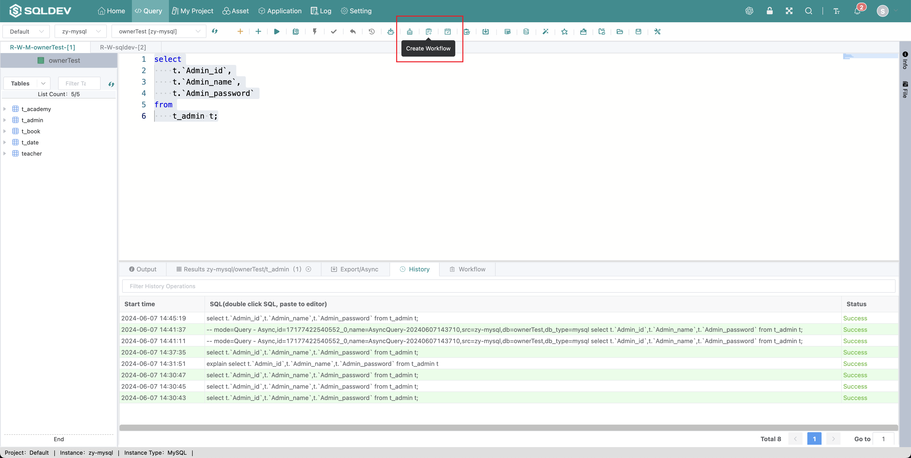
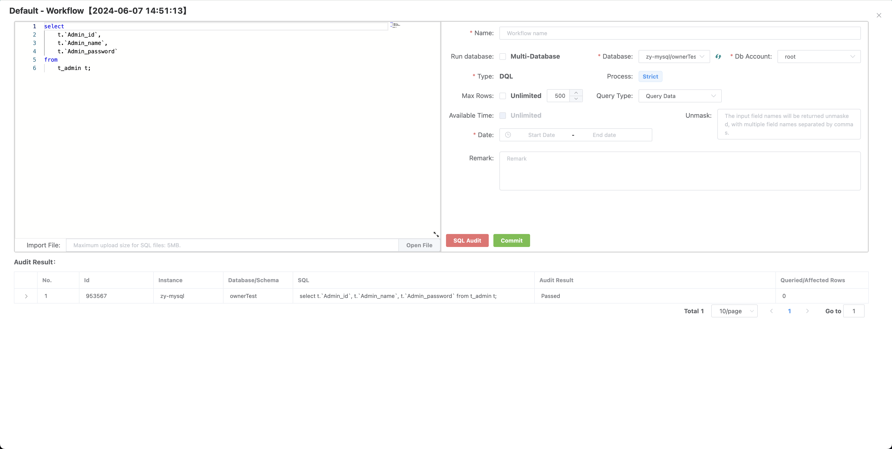

# Workflow

> If workflow permission is enabled in the current database, a workflow will be submitted when a modification operation is performed and will wait for the administrator's review.
>
> Operation.
>
> 1. Execute special SQL, such as: update, delete, insert, etc.
>
> 2、Enter the workflow name
>
> 3. Click "Submit"
>
> 4、Click "Data Display Area" - "My workflows" to check the workflow list

Figure: Submit workflow image

