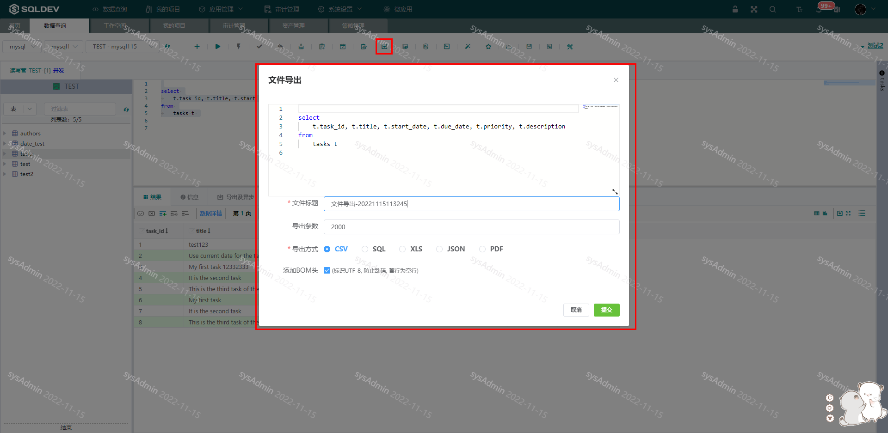
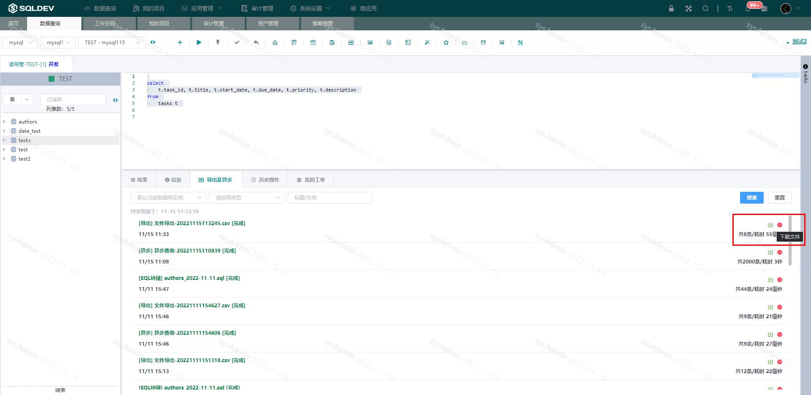

# 异步导出

> 注：导出SQL执行结果，支持CSV、SQL、XLS、JSON四种导出方式
>
> 操作：
>
> ​  1、选中SQL
>
> ​  2、点击“异步导出”按钮
>
> ​  3、在弹出框中输入名称、查询条数、导出类型
>
> ​  4、点击提交
>
> ​  5、异步导出结果在“导出及异步”列表中查看
>
> ​  6、点击列表右侧“下载”按钮，下载导出结果

图：创建异步导出图

图：异步导出列表图
