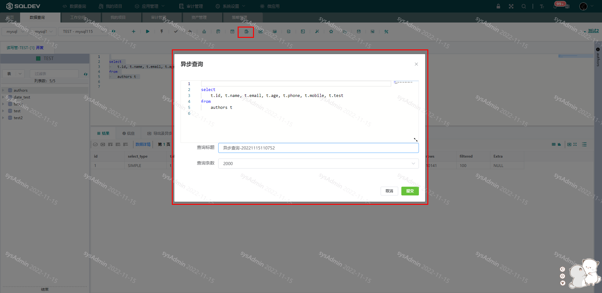
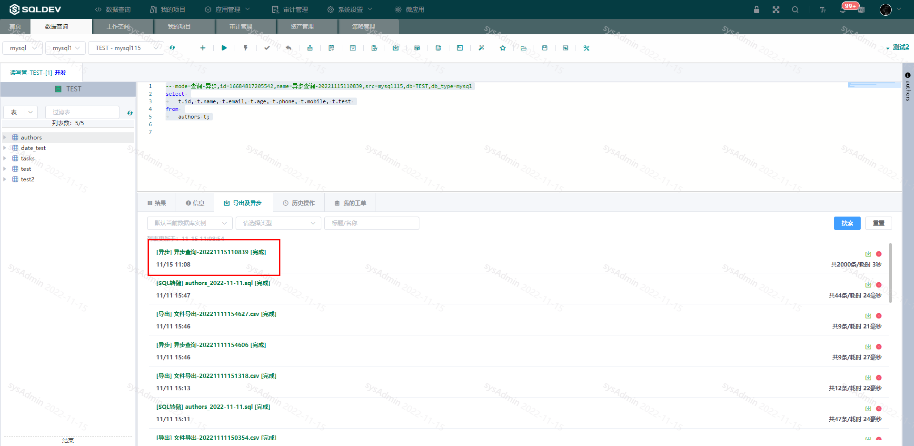
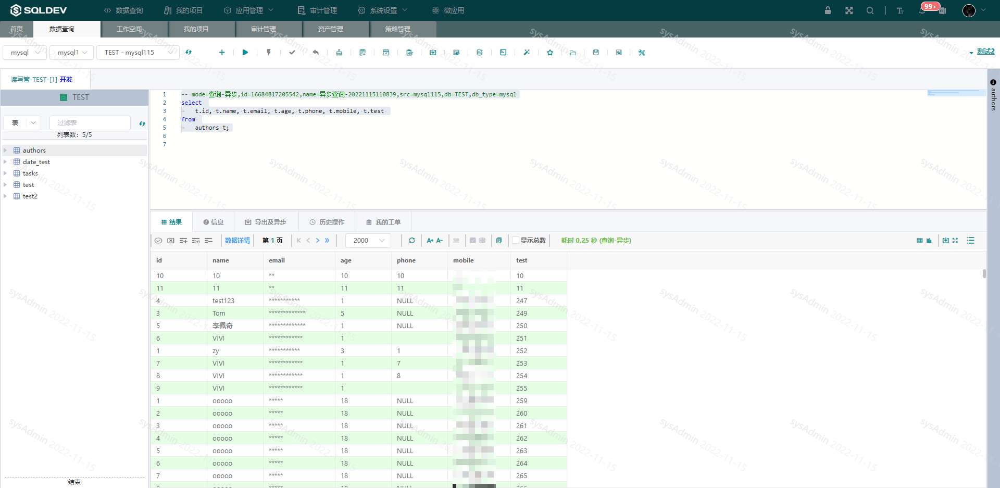

# 异步查询

> 注：当SQL执行时间过长时可使用该功能，查询结果会缓存到服务端，异步执行完成后可在“数据展示区” - “导出及异步”表中查看
>
> 操作：
>
> ​  1、选中SQL
>
> ​  2、点击“异步查询”按钮
>
> ​  3、在弹出框中输入名称、查询条数
>
> ​  4、点击提交
>
> ​  5、异步查询结果在“导出及异步”列表中查看

图：创建异步查询图

图：异步查询列表图

图：异步查询结果图
