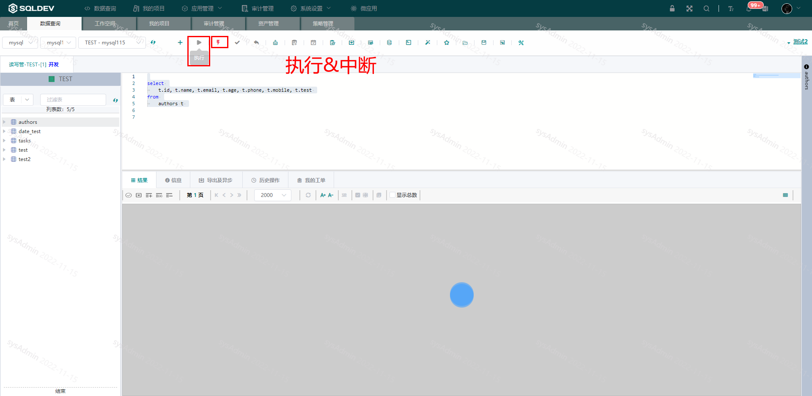

# 执行脚本/中断执行

> **执行脚本**：
>
> 操作：
>
> ​  1、选中SQL语句（不选中SQL则执行编辑器中的所有SQL）
>
> ​  2、点击“执行”按钮，执行SQL语句
>
>
>
> **中断执行**：当执行脚本时间过长时，点击中断执行（为红色红色可点击时），结束执行脚本操作，对于执行时间过长的SQL语句可以改用异步查询
>
> 操作：
>
> ​  1、当点击“执行”按钮后，且未完成SQL执行时，即：因为执行时间过长处于可中断状态：
>
> ​  2、点击“中断”按钮，中断当前执行

图：执行脚本图

####
