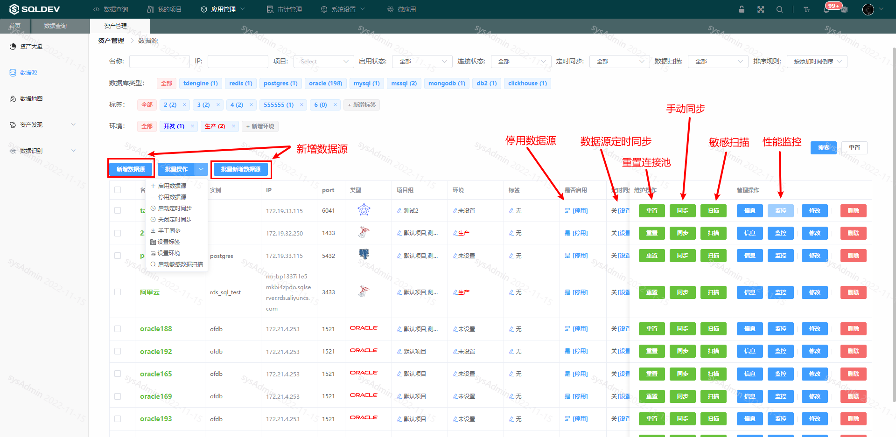
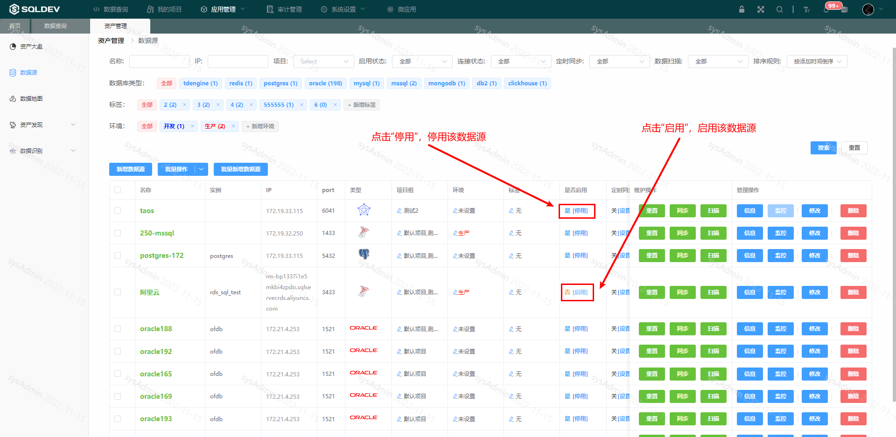
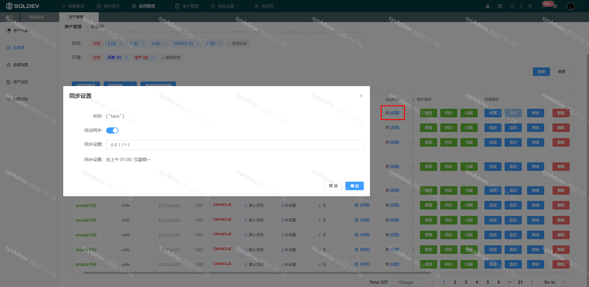
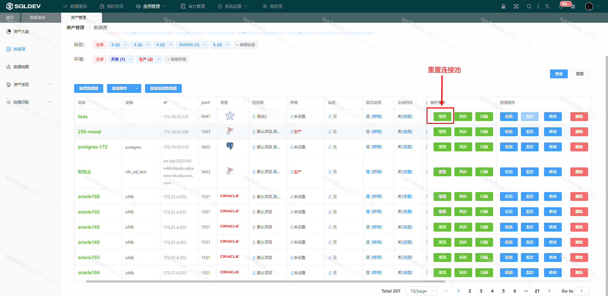
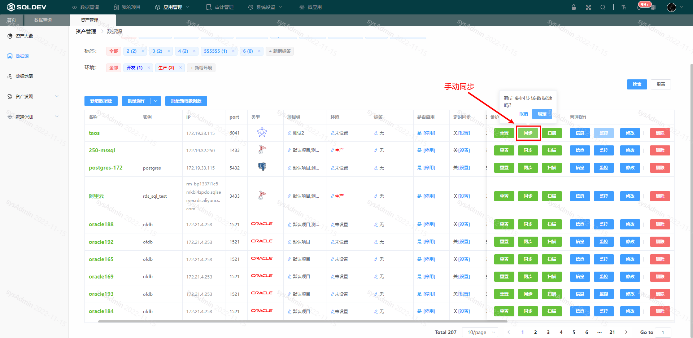

# 数据源

#### 1. 新增数据源

###### 数据源管理

> 系统管理员管理数据源：
>
> ​  1、新增数据源
>
> ​  2、开启数据源/停用数据源
>
> ​  3、数据源定时同步
>
> ​  4、重置数据源连接池
>
> ​  5、手动同步数据源
>
> ​  6、修改数据源配置
>
> 操作：
>
> ​  1、点击“应用管理”-“资产管理”-“数据源”菜单
>
> ​  2、操作

图：数据源列表图

###### 新增数据源

> 操作：
>
> ​  1、点击“新增数据源”按钮
>
> ​  2、在弹出框：输入数据源名称、选择数据源类型、输入数据源描述
>
> ​  3、点击确定

图：新增数据源图

###### 开启数据源/停用数据源

> 操作：
>
> ​  1、点击“停用”/“启用”，如下图：

图：停用/启用数据源图

###### 数据源定时同步

>对于数据结构经常变化（添加表、修改表结构等）的数据源，可以使用定时同步功能。
>
>操作：
>
>​ 1、在“定时同步”列，点击“设置”
>
>​ 2、开启“自动同步”开关
>
>​ 3、设置同步规则
>
>​ 4、点击确定

图：定时同步图

###### 重置数据源连接池

> 重置数据源的连接池
>
> 操作：
>
> ​  1、点击“重置连接池”按钮，如下图

图：重置连接池图

###### 手动同步数据源

> 手动同步数据源

图：手动同步图

###### 修改数据源配置

> 名称、ip地址、端口、数据库、用户名、密码、权限、连接数、最大查询数量、描述
>
> 操作：
>
> ​  1、点击“修改”按钮
>
> ​  2、修改数据源信息，如下图：

图：数据源配置图

