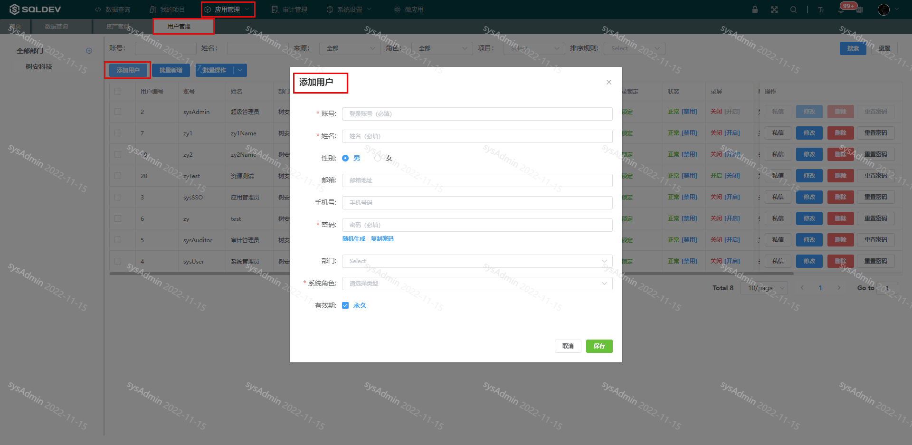
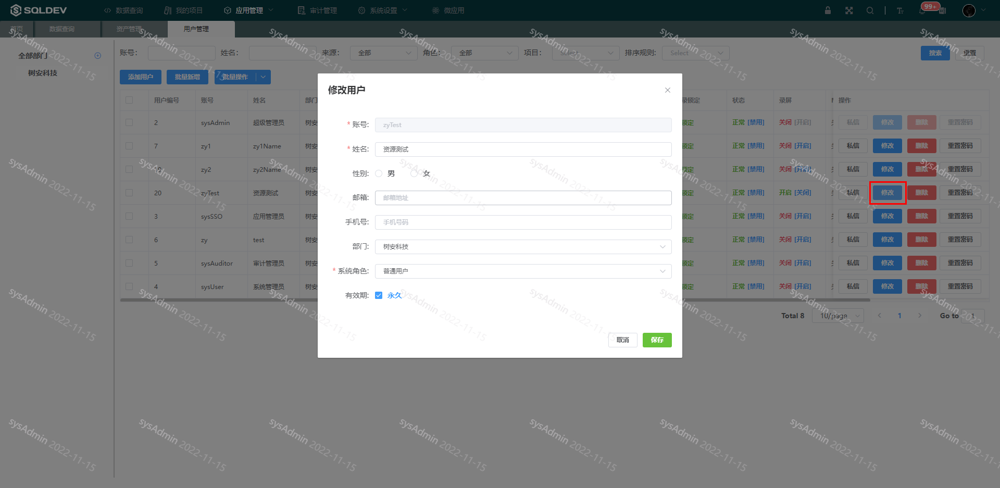
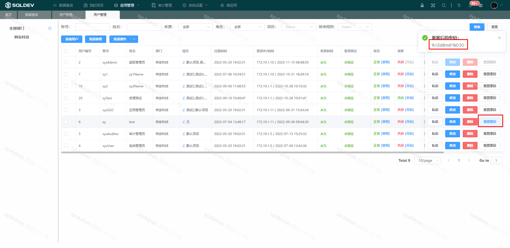

# 用户

##### 新增用户

> 新增的用户为系统用户，这时该用户可以登录SQLDEV系统，该用户可以申请加入项目，或由管理员关联进入项目
>
> 操作：
>
> ​  1、点击“新增用户”按钮
>
> ​  2、弹出框：填写登录名、姓名、密码、系统角色，如下图：

图：新增用户图

##### 修改用户

> 操作：
>
> ​  1、点击”修改“按钮，
>
> ​  2、弹出框：修改、姓名、系统角色，如下图：

##### 重置密码

> 修改密码/重置密码
>
> 操作：
>
> ​  1、点击”重置密码“按钮
>
> ​  2、弹出框为重置后的密码

图：重置密码图

