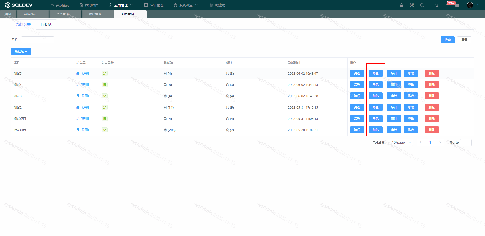
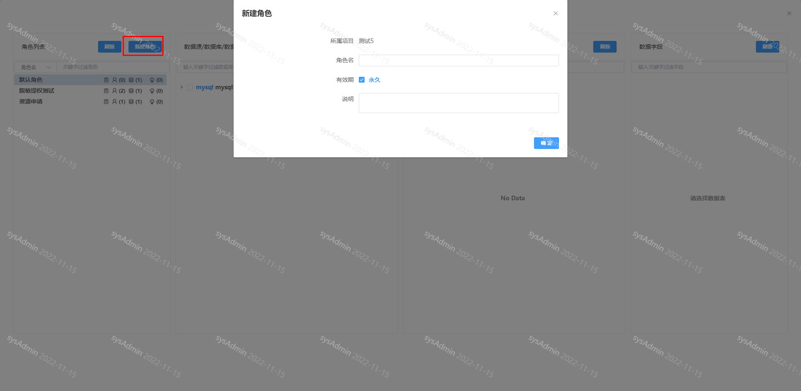
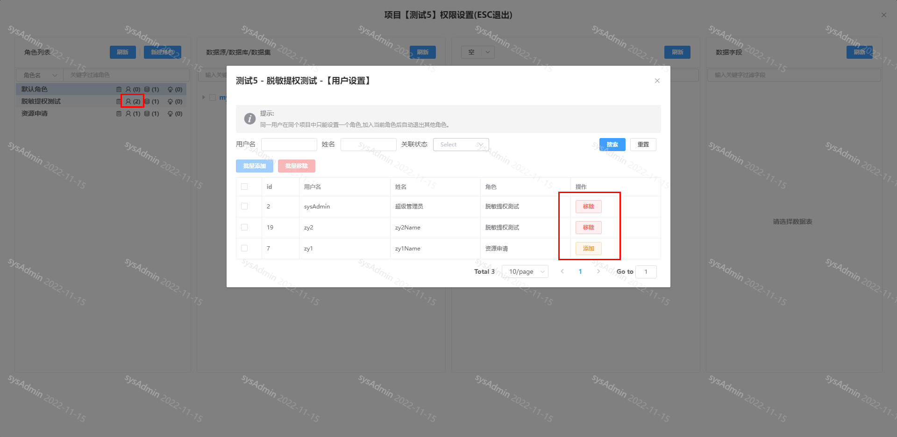
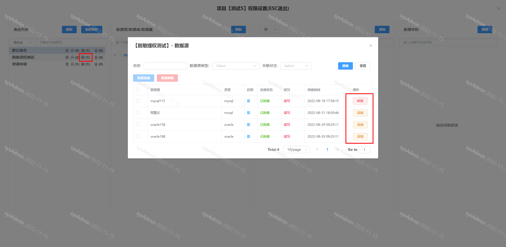
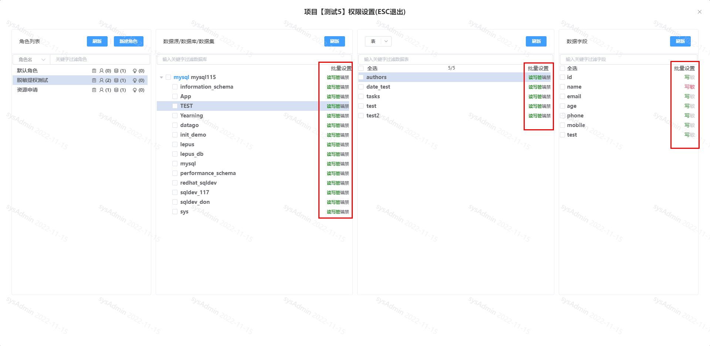
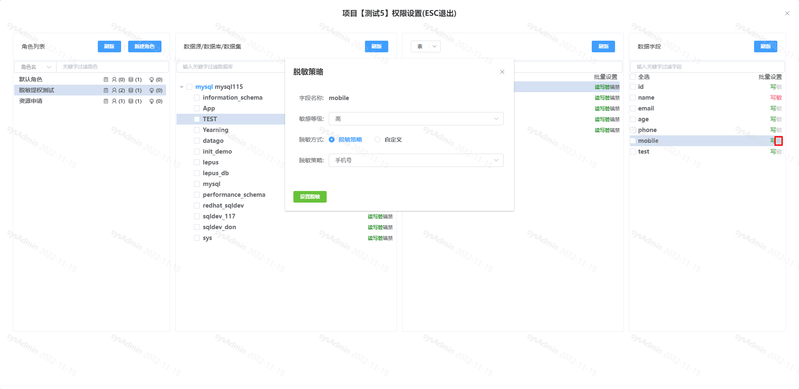
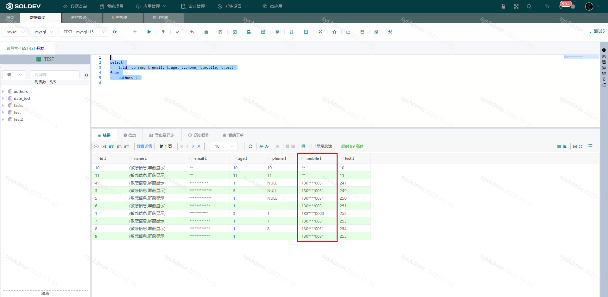

# 角色

这里的角色，是指项目中的角色，需要管理员身份，进入项目管理，选择菜单【权限-->权限设置】。

##### 1.进入角色设置

##### 2.创建角色

项目角色设置中创建角色

图：创建角色图

##### 3. 角色关联/移除用户

点击角色的用户图标在弹窗中将用户关联到角色

图：角色关联/移除用户图

##### 4. 角色关联/移除数据源

点击角色的数据库图标在弹窗中将数据库关联到当前角色。

图：角色关联/移除数据源图

##### 5. 角色权限设置
通过点击角色名称展开当前角色关联的数据源列表，点击对应的数据源，可对库、表设置只读(DQL)、读写(DML)、管理(DDL)权限。

图：角色权限图

##### 5. 字段脱敏设置

点击角色展开当前角色关联的数据源，选择对应字段上的“敏”，在弹窗中选择脱敏方式并点击按钮提交。

图：字段脱敏图

设置完毕后，切回查询页面，查看查询结果，字段已经被脱敏后显示。

图：查询脱敏图

