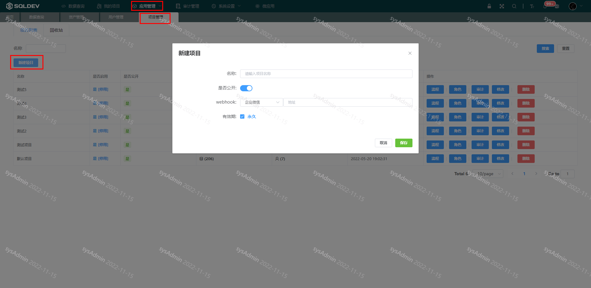
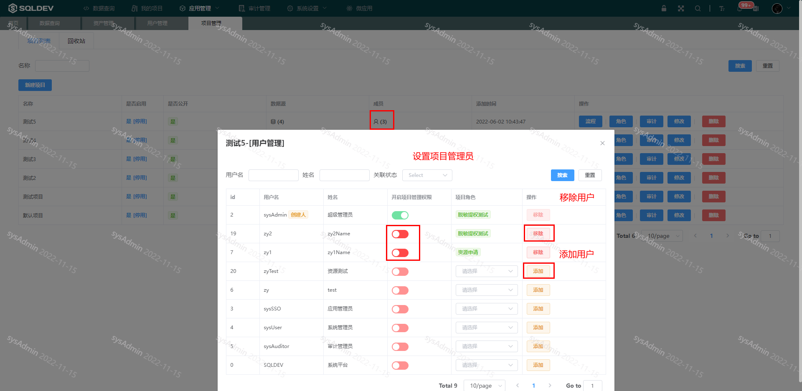
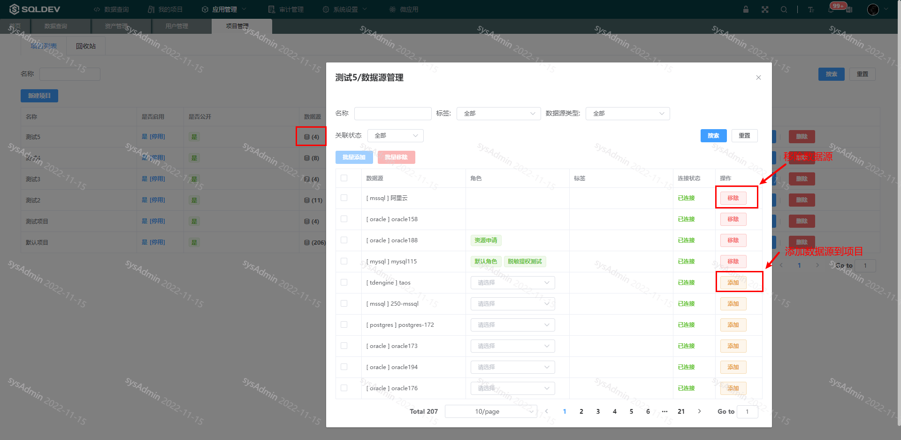
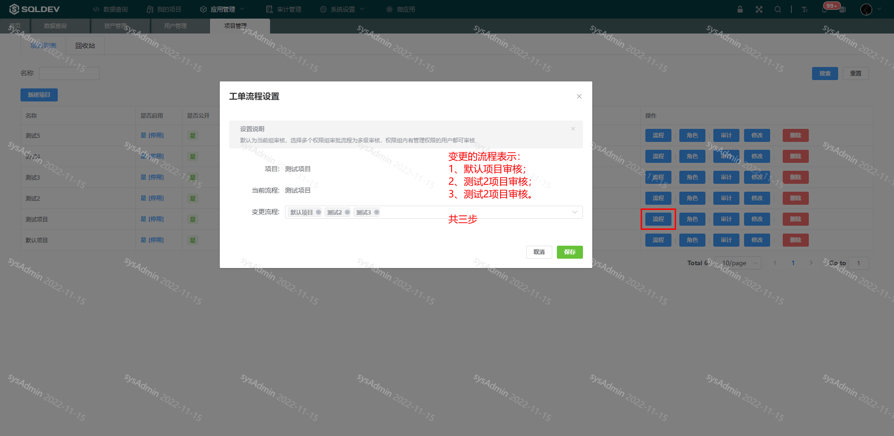
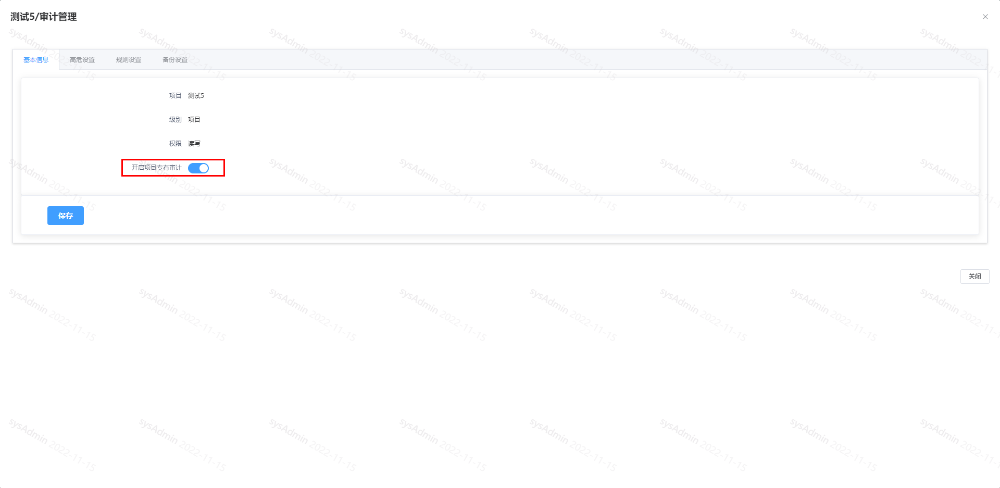
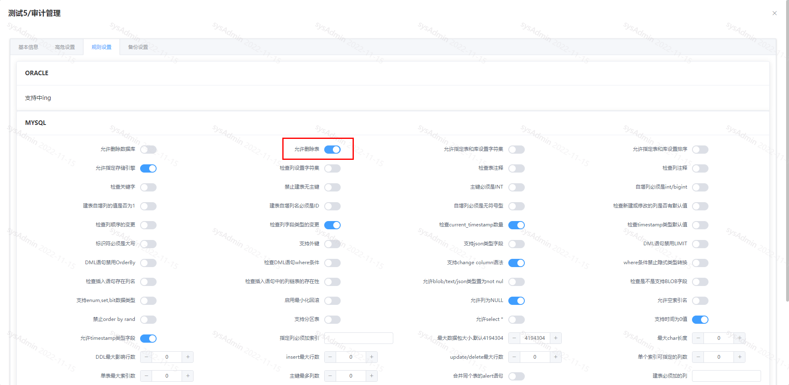
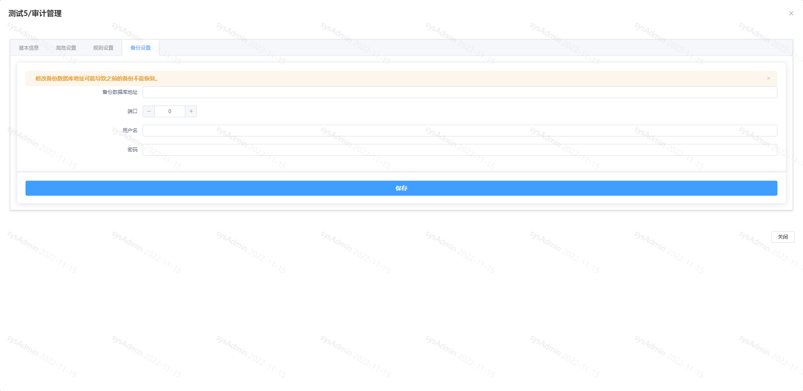
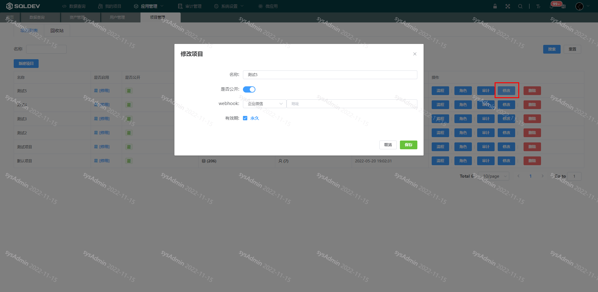

# 项目

##### 新建项目

> 操作：
>
> ​  1、点击“新建项目”按钮
>
> ​  2、在弹出框：输入项目名称、选择是否公开**（用户可主动申请加入公开项目）**、勾选永久有效或设置到期时间

* 公开项目：用户可主动申请加入
* 项目设置有效期：到期后项目将不可操作

图：新建项目图

##### 关联/移出项目成员&设置项目管理员

> 项目关联用户、项目移出用户
>
> 操作：
>
> ​  1、点击“成员”图标，关联/移出用户
>
> ​  2、点击“添加”/“移出”按钮，用以管理项目用户，如下图：
>
> ​  或
>
> ​  2、点击“管理权限”列中的“[+]”设置项目管理员，如下图：

图：关联/移出用户&设置项目管理员图

##### 项目数据源管理

> 操作：
>
> ​  1、点击“数据源”图标，关联/移出数据源
>
> ​  2、在弹出框：点击“移出”按钮，移出该项目
>
> ​  或
>
> ​  2、在弹出矿：点击“添加”按钮，关联项目与数据源

图：项目数据源管理图

##### 工单流程

> 默认为当前组（当前项目的管理员其中之一）审核，选择多个权限组审批流程为多级审核，权限组内有管理权限的用户都可审核。
>
> 操作：
>
> ​  1、点击“流程”按钮
>
> ​  2、在弹出宽：多选流程，如下图：

图：工单流程设置图

##### 审计（配置）

> 只有开启项目专有审计，才能修改审计规则
>
> 操作
>
> ​  1、点击“审计”按钮
>
> ​  2、弹出框：开启项目专有审计，修改项目审计配置（开启后，该配置只作用于该项目）

图：审计配置图

* 备份设置，如下图：

图：备份设置图

##### 修改项目

> 功能：修改项目名、修改项目是否公开、修改项目有效期
>
> 操作：
>
> ​  1、点击“修改”按钮，
>
> ​  2、弹出框：输入项目名、开/关项目是否公开、勾选项目过期时间是否永久不过期或设置项目过期时间，如下图：

图：修改项目信息图

