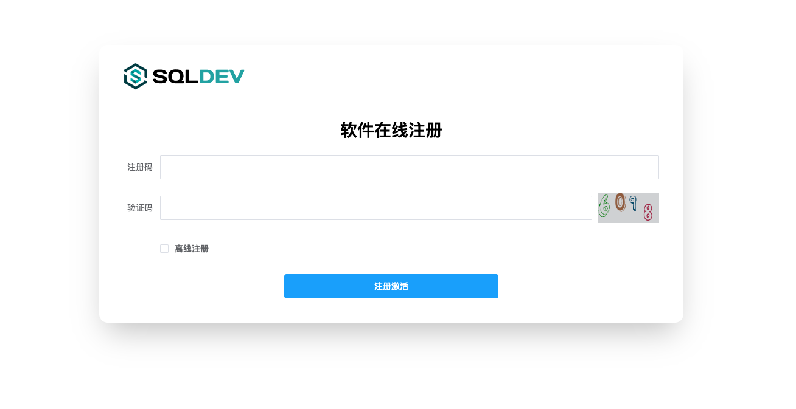
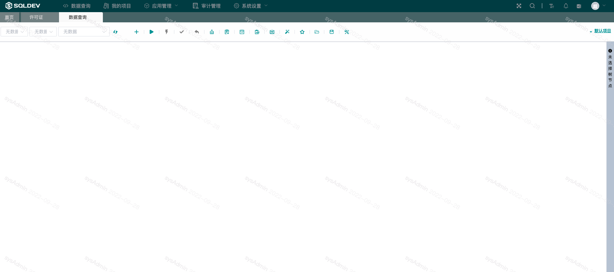

# 安装

#### 一键安装脚本

```
/bin/bash -c "$(curl -fsSL https://raw.githubusercontent.com/shuaninfo/sqldev-community-install/master/install.sh)"
```

或者，您也可以参考下文进行手动安装

##### 默认安装目录

```
cd /opt
```

##### 下载安装包

```
wget https://github.com/shuaninfo/sqldev/releases/download/sqldev-xxx.xxx.xxx.tar.gz
```

##### 解压缩

```
tar -zxvf sqldev-xxx.xxx.xxx.tar.gz
```

##### 进入应用目录

```
cd sqldev
```

##### 安装依赖 mysql redis oracle-lib

```
sh install.sh
```


##### 启动

```
#启动
sh start.sh

```


##### 使用浏览器（推荐Chrome）访问 http://应用ip地址:9000


1.首次安装会进入初始化界面，如果这里没有出现初始化界面，请刷新浏览器。

2.初始化完毕后请注意保存账号密码信息。

3.点击跳转登录后使用管理员账号登录系统即可。


##### 注册激活

> 如未申请licence注册码，请申请[license](./许可.md)





##### 激活后，点击菜单进入软件使用界面





##### 常见问题

**./sqldev: error while loading shared libraries: libclntsh.so.12.1: cannot open shared object file: No such file or directory**

解决方案： `source /etc/profile   `

重启应用